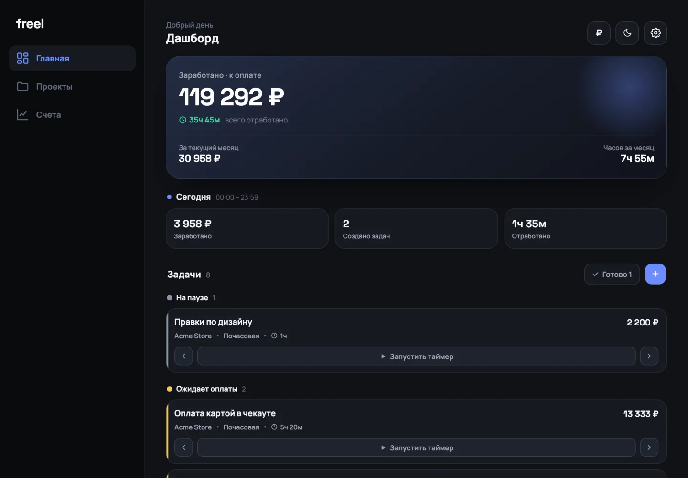
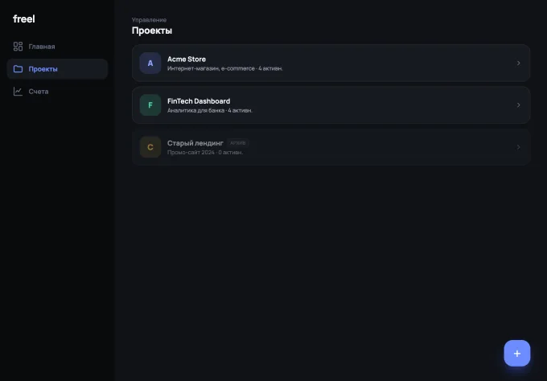
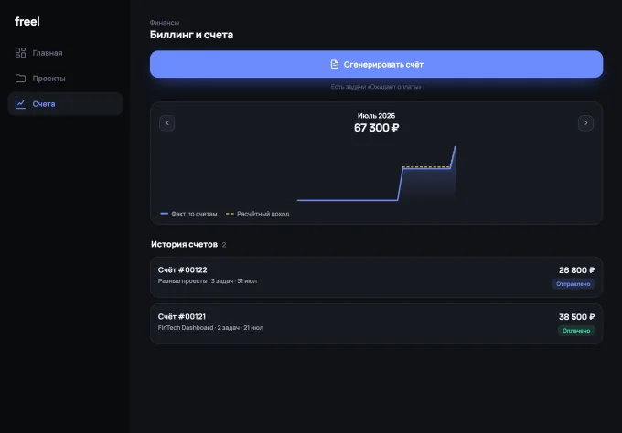

# freel

A time tracker and invoicing app for freelance work. One codebase for desktop and Android: projects, tasks, a running timer, and invoices generated from the hours it recorded.

> Built for personal use. Everything lives in a local SQLite file; the optional sync server is a separate service and is not part of this repository — see [Sync](#sync). Interface is Russian only.

<p align="center">
  
</p>
<p align="center">
  
  &nbsp;&nbsp;
  
</p>
<p align="center">
  <sub>Dashboard &nbsp;·&nbsp; Projects &nbsp;·&nbsp; Billing</sub>
</p>

## Features

**Tracking**

- Projects → tasks → time entries, one day of work per entry
- Timer with pause; elapsed time survives quitting the app
- Hourly or fixed rate per task, in RUB / USD / EUR / GBP / CNY
- Eight task statuses — paused, next, in work, code review, manager review, awaiting upload, awaiting payment, done

**Billing**

- Invoices generated from completed tasks, grouped by project
- Plain-text export for sending to a client, hours rounded to the nearest half
- Invoice statuses: awaiting, sent, paid
- Month chart — a solid line for money actually received against a dashed line for what the invoices expected

**Desktop**

- **Edge panel** — a second window that slides out when the pointer rests against the left screen edge, so time can be started and stopped without bringing the main window forward
- Running timer mirrored into the window title: `1:24:07 · Landing page — freel`

**Android**

- Ongoing timer notification with a system chronometer and pause / resume / stop buttons, held by a foreground service — it keeps counting with the app backgrounded and no JavaScript running. Implemented as a separate crate, [`tauri-plugin-timer`](../tauri-plugin-timer)

<p align="center">
  
</p>

**Data**

- Backup and restore through a versioned JSON file — v1 files still import into the v2 format
- Optional sync between devices against a self-hosted server
- Soft deletes: rows are tombstoned, never dropped

## Architecture

```
React 19 + Zustand  (main window and edge panel, one bundle, two roots)
        │
        ├─ tauri-plugin-sql ──► SQLite (freel.db)      reads and simple writes
        │
        └─ invoke() ──► Rust
                          ├── soft_delete       cascade in one transaction
                          ├── restore_backup    whole file applied atomically
                          └── sync              round trip + local apply, also
                                                one transaction; the account
                                                token never enters JavaScript
```

Anything that must not be half-applied goes through Rust. `tauri-plugin-sql` spreads separate `execute` calls across pooled connections, so a cascade issued from JavaScript could survive a failure half-done. `sqlx` is pinned to the same 0.8 line the plugin resolves to, which makes the plugin's pool this crate's pool and lets those commands open a real transaction on it.

## Sync

Off by default. When configured, the app talks to a self-hosted server over three endpoints — `auth/register`, `auth/login`, `sync` — with a token stored in the settings table.

The whole exchange lives in Rust rather than the web view for three reasons: the reply has to be applied in one transaction, a request from `tauri://` would be blocked by CORS, and the token then never has to exist in JavaScript at all.

- Deletions travel as tombstones — unlike a backup, which is a snapshot of what exists, a sync payload has to carry what no longer does
- The auto-sync loop starts 8 seconds after launch and is nudged by a dirty flag, so an edit syncs promptly instead of waiting out the interval
- Settings, invoice numbering and the running timer stay device-local: numbering has to stay unique per device, and a timer belongs to the machine it was started on

**The server is not in this repository.** Without it the app is a fully working local tracker; the sync screen simply stays disconnected.

## Stack

| Layer | Technology |
|---|---|
| Shell | Tauri 2 (desktop + Android) |
| UI | React 19, Zustand 5, hand-written CSS |
| Storage | SQLite via `tauri-plugin-sql`, `sqlx` for transactional writes |
| HTTP | `reqwest` (rustls) |
| Android notification | [`tauri-plugin-timer`](../tauri-plugin-timer) — own plugin, Kotlin |
| Fonts | Manrope + Space Grotesk, self-hosted via Fontsource |
| Build | Vite 7, TypeScript 5.8 |

## Build

The app depends on the timer plugin by relative path, so both repositories have to sit side by side:

```
Freel/
  freel-client/
  tauri-plugin-timer/
```

```bash
npm install
npm run tauri dev              # desktop
npm run tauri android dev      # Android, device or emulator
npm run tauri build            # desktop bundle
npm run tauri android build    # APK
```

Requires Rust, Node, and for Android: JDK 17+, the Android SDK and NDK with `ANDROID_HOME` / `NDK_HOME` set.

## Project structure

```
src/
  App.tsx              main window — tabs, onboarding, splash
  PanelApp.tsx         edge panel — same bundle, mounted by window label
  domain/              pure logic, no I/O
    earnings.ts          elapsed time, live minutes, amounts
    money.ts, time.ts    formatting
    invoiceText.ts       invoice → plain text for the client
    chart.ts             month chart paths — expected vs received
    backup.ts            backup format, v1 → v2 migration on import
    status.ts, types.ts  statuses, shared types
  db/
    client.ts            query helpers over tauri-plugin-sql
    softDelete.ts        tombstoning through the Rust cascade
    repositories/        projects, tasks, time entries, invoices, settings
  screens/             Dashboard, Projects, Billing, Onboarding
  modals/              task, project, invoice generation, invoice detail,
                       done tasks, settings
  services/            sync, backup file dialogs, window title
  notifications/       Android ongoing timer notification
  store/               Zustand store, timer tick

src-tauri/src/
  lib.rs               migrations, panel window, edge watcher, tray,
                       soft_delete and restore_backup commands
  sync.rs              register / login / sync, auto-sync loop
```

## Schema

`settings` (single row, holds the active timer), `projects`, `tasks`, `time_entries`, `invoices`, `invoice_items`. Every table carries `created_at` / `updated_at` and a nullable `deleted_at` — the pair sync compares to decide what travels.

## Not built yet

- No automated tests. The domain layer is pure and would be straightforward to cover; nothing covers it today
- Interface strings are Russian, hard-coded, with no i18n layer
- Desktop is developed and tested on macOS; the edge panel relies on `macOSPrivateApi` for transparency

## License

MIT
